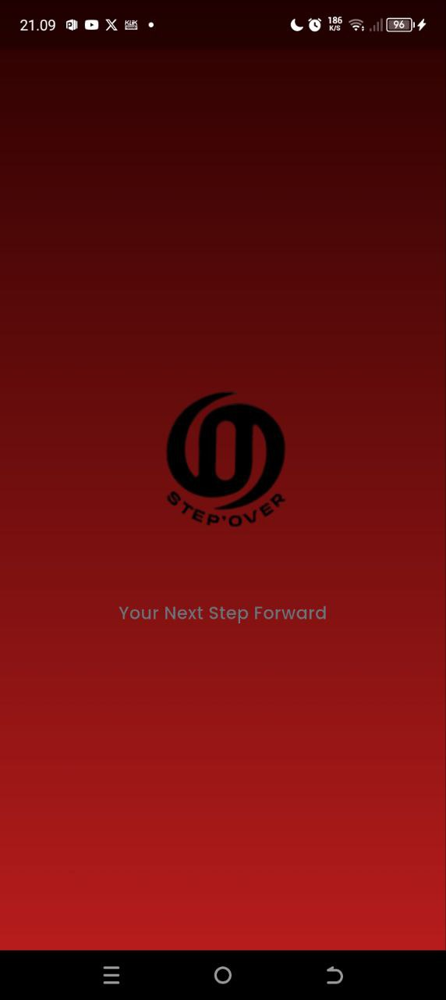
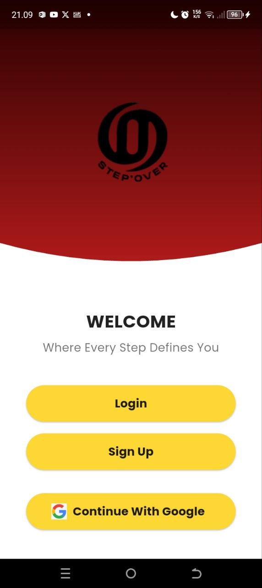
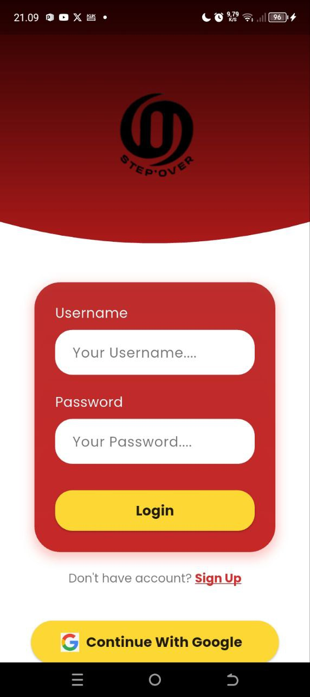
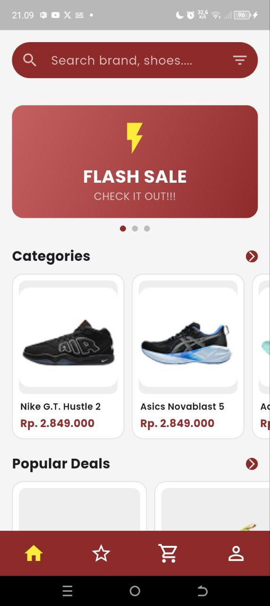
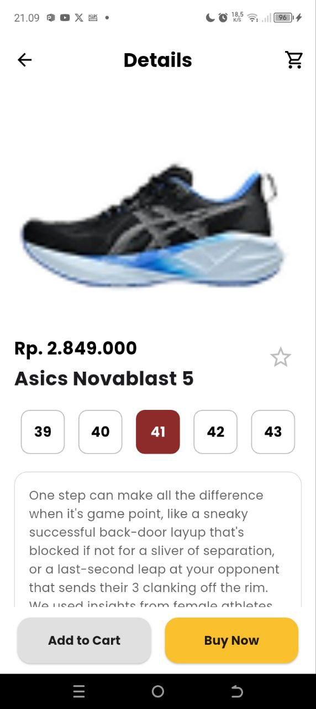
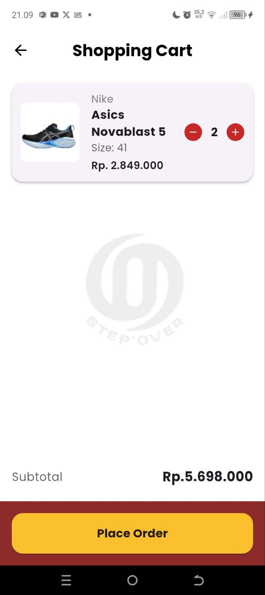
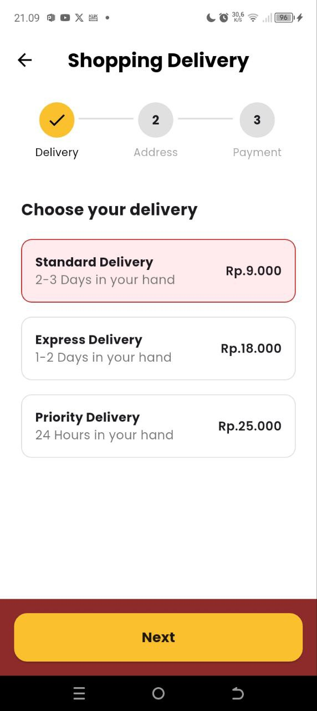
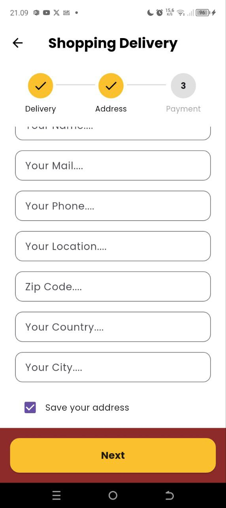
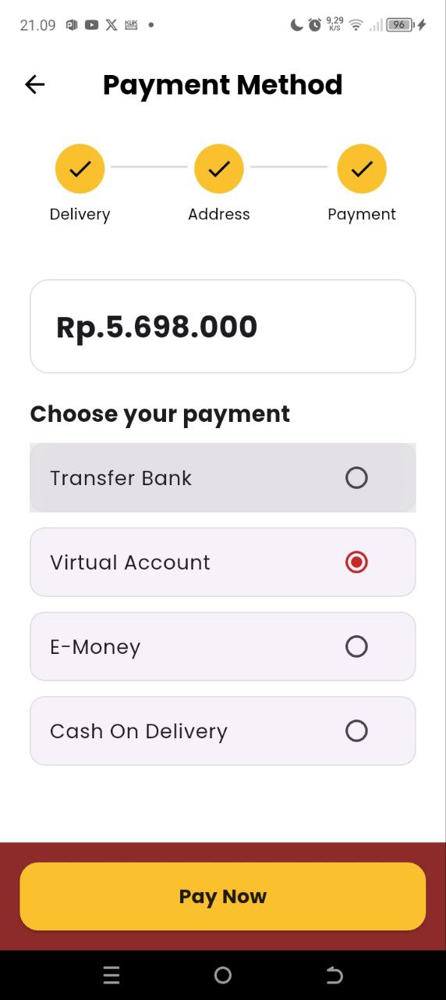
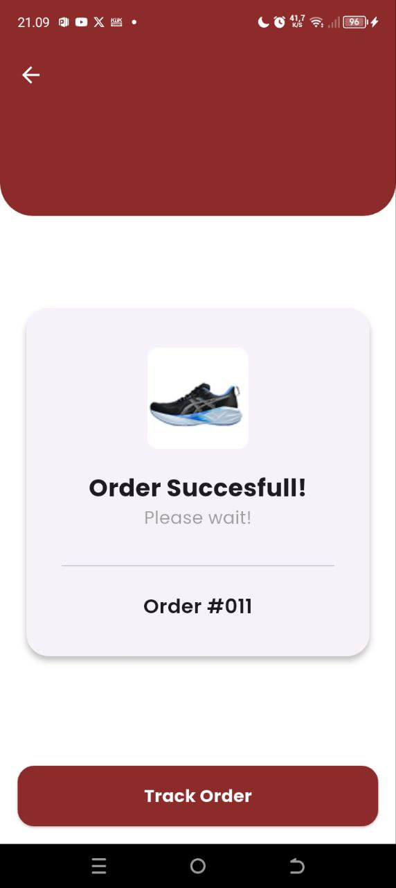

# Anggota Kelompok :
1. Sita Novitasari 085023006
2. Sabran Jamila 085023011
3. Nehemiah Stephen 085023019
4. M Reynaldi Bayu Aji 085023012

# Step Over - Aplikasi E-commerce Sepatu

Step Over adalah prototipe aplikasi mobile e-commerce yang berfokus pada penjualan sepatu, dibangun sepenuhnya menggunakan Flutter. Aplikasi ini menampilkan alur kerja lengkap mulai dari halaman pembuka, penjelajahan produk, hingga proses checkout.

## 📸 Tampilan Aplikasi & Penjelasan

Berikut adalah tampilan dari setiap layar utama dalam aplikasi Step Over beserta penjelasan singkat fungsinya.

### 1. Splash & Welcome Screen

**Splash Screen**: Tampilan awal yang muncul saat aplikasi pertama kali dibuka, menampilkan logo "Step Over" dengan latar belakang gradien yang elegan untuk memberikan kesan pertama yang kuat.

**Welcome Screen**: Halaman penyambut setelah splash screen, memberikan opsi navigasi yang jelas kepada pengguna untuk masuk (Login) atau mendaftar (Sign Up).

| Splash Screen | Welcome Screen |
|---------------|----------------|
|  |  |

### 2. Login Screen
Halaman ini didesain untuk pengguna yang sudah memiliki akun. Terdapat form untuk memasukkan username dan password, serta opsi untuk melanjutkan dengan akun Google.

### 3. Dashboard
Halaman utama aplikasi tempat pengguna dapat menjelajahi produk. Fitur utamanya meliputi:
- Search bar
- Banner promosi interaktif
- Daftar kategori produk
- Bagian penawaran populer

### 4. Halaman Detail Produk
Menampilkan:
- Gambar produk besar
- Deskripsi lengkap
- Harga
- Pilihan ukuran sepatu yang dinamis dan interaktif

### 5. Keranjang Belanja (Shopping Cart)
Fitur:
- Daftar item yang ditambahkan
- Gambar, nama, dan ukuran produk
- Pengatur jumlah barang
- Subtotal otomatis

### 6. Alur Pembayaran & Halaman Sukses

**Alur Pembayaran**: Proses checkout multi-langkah:

| Pilih Pengiriman | Isi Alamat | Pilih Pembayaran |
|------------------|------------|------------------|
|  |  |  |

**Halaman Sukses**: Konfirmasi setelah pesanan berhasil dibuat

## ✨ Fitur Utama

- **Splash Screen** dengan animasi menarik
- **Autentikasi Pengguna**:
  - Halaman Welcome dengan Login/Sign Up
  - Opsi login dengan Google
- **Dashboard Utama**:
  - Search Bar dengan filter
  - Banner promosi interaktif
  - Kategori produk
  - Popular Deals
- **Detail Produk**:
  - Gallery produk
  - Informasi lengkap
  - Pilihan ukuran dinamis
- **Keranjang Belanja**:
  - Manajemen item
  - Kalkulasi harga otomatis
- **Checkout Flow**:
  - Multi-step process
  - Pilihan pengiriman
  - Metode pembayaran
- **Konfirmasi Pesanan**

## 🛠️ Teknologi & Dependensi

**Teknologi Utama**:
- Framework: Flutter
- Bahasa: Dart

**Dependensi**:
- `google_fonts`: Untuk font kustom (Poppins)
- `intl`: Untuk format mata uang Rupiah

## 🚀 Cara Menjalankan

1. Pastikan Flutter SDK terinstal
2. Clone repository ini
3. Jalankan `flutter pub get`
4. Jalankan aplikasi dengan `flutter run`
